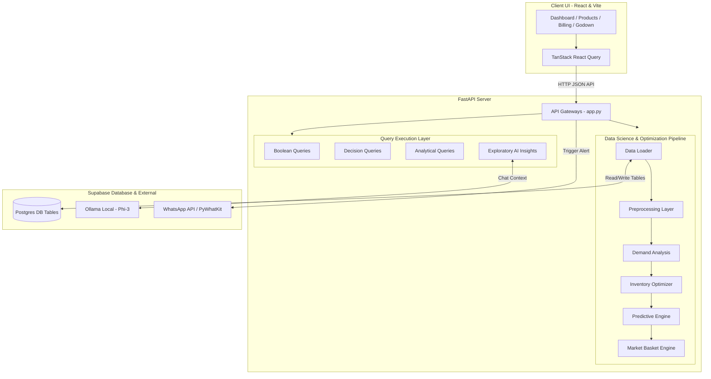

# Intelligent ERP & Inventory Management System with Predictive Forecasting

An enterprise-grade Intelligent ERP Plugin and Inventory Management System designed to optimize supply chain pipelines, automate stock control, and provide real-time AI-driven demand forecasting. Built using a modern React frontend (Vite, TypeScript, Tailwind CSS, Shadcn UI) and a fast Python backend (FastAPI, Pandas, Supabase, Ollama, PyWhatKit).

---

## 🚀 Key Features

* **Comprehensive Inventory Management & CRUD**:
  * Real-time dashboard highlighting overall stock health, total active items, stockout risks, overstocked items, and high/low demand count.
  * Complete product life-cycle operations including a custom recycle bin with restore and permanent deletion mechanisms.
* **Analytical & Decision Query Layer**:
  * Calculates inventory optimization metrics dynamically: **Safety Stock**, **Reorder Point (ROP)**, **Reorder Quantity (ROQ)**, **Inventory Turnover**, and **ABC Classification** (categorizing items A, B, or C based on their financial sales value).
* **Predictive Seasonal Inventory Engine**:
  * Date-driven engine that checks current date windows against active rules in `seasonal_inventory`, `festival_inventory`, and `national_day_inventory`.
  * Dynamically transitions inventory modes (`PREDICTIVE`, `REVIEW_DEADLINE`, `REVIEW_MANUAL`) and automatically calculates upcoming demand spikes.
  * Generates restock recommendations for the Godown manager, recommending both existing products (`EXPS`) and new temporary items (`PS`).
* **AI-Powered Product Insights (Natural Language Explorer)**:
  * Chatbot interface that communicates with a local **Ollama** server running the `phi3` model to answer queries about product status.
  * Maintains localized, persistent chat logs inside Supabase to preserve the context of current sessions.
* **Integrated Billing & Sales System**:
  * Complete checkout interface with instant stock validation.
  * Deducts inventory stock instantly on purchase and logs completed transactions.
* **Association Rule Mining (Market Basket Analysis)**:
  * Computes item pairs frequently bought together and provides real-time confidence-based recommendation pairs for cross-selling.
* **Automated WhatsApp Alerts**:
  * Uses `pywhatkit` to send instant WhatsApp notifications to the godown manager when restocking is required.

---

## 📐 Architecture



---

## 📊 Database Schema (Postgres / Supabase)

The system relies on the following relational table configurations:

### Core Inventory Tables
* **`product_table`**:
  * `item_id` (Text, Primary Key)
  * `item_name` (Text)
  * `category` (Text)
  * `unit_price` (Numeric)
  * `inventory_mode` (Text - e.g., `NORMAL`, `PREDICTIVE`, `REVIEW_DEADLINE`, `REVIEW_MANUAL`)
  * `predictive_tag` (Text - e.g., `EXPS`, `PS`)
  * `predictive_start` / `predictive_end` (Text)
  * `predictive_reason` (Text)
  * `predictive_score` (Integer)
  * `is_deleted` (Boolean)
* **`inventory_table`**:
  * `item_id` (Text, Foreign Key)
  * `current_stock` (Integer)
  * `lead_time_days` (Integer)
  * `is_deleted` (Boolean)
* **`sales_transactions`**:
  * `transaction_id` (Text, Primary Key)
  * `date` (Date/Text)
  * `item_id` (Text)
  * `quantity_sold` (Integer)
* **`purchase_table`**:
  * `date` (Date/Text)
  * `item_id` (Text)
  * `quantity_purchased` (Integer)

### Billing & History Tables
* **`billing_master`**:
  * `bill_id` (UUID, Primary Key)
  * `customer_name` (Text)
  * `total_amount` (Numeric)
  * `status` (Text - `draft` or `completed`)
  * `created_at` (Timestamp)
* **`billing_items`**:
  * `id` (UUID, Primary Key)
  * `bill_id` (UUID, Foreign Key)
  * `item_id` (Text)
  * `quantity` (Integer)
  * `unit_price` (Numeric)
  * `total_price` (Numeric)
* **`item_history`**:
  * Tracks manual/bulk restock events.
  * `id` (UUID), `item_id` (Text), `product_name` (Text), `quantity_added` (Integer), `type` (Text), `created_at` (Timestamp)

### Analytical, Predictive & Chat Tables
* **`seasonal_inventory`** / **`festival_inventory`** / **`national_day_inventory`**:
  * Houses historical rule definitions containing active dates (e.g. `20-12` to `10-01`), `suggested_quantity`, and seasonal tags.
* **`market_basket_recommendations`**:
  * `item_id` (Text), `recommended_item_id` (Text), `confidence` (Integer)
* **`exploratory_chat_history`**:
  * `item_id` (Text), `question` (Text), `answer` (Text), `created_date` (Date), `created_at` (Timestamp)

---

## 🛠️ Technology Stack

### Frontend
* **Core**: React (v18), Vite, TypeScript
* **State & Data Fetching**: TanStack React Query
* **Styling**: Tailwind CSS, Shadcn UI components, Radix UI primitives
* **Charts**: Recharts (for historic demand graphs)
* **Icons**: Lucide React

### Backend
* **Core**: FastAPI (Python 3.10+), Uvicorn
* **Data Processing**: Pandas, NumPy
* **Clients & Networking**: Supabase Client SDK, Requests
* **Automation Alerts**: PyWhatKit (WhatsApp Messaging)

### Infrastructure & Services
* **Database**: Supabase PostgreSQL
* **Local LLM Server**: Ollama (Phi-3-mini)

---

## ⚙️ Configuration & Installation

### Prerequisite Setup
1. **Ollama**:
   * Install [Ollama](https://ollama.com/) locally.
   * Run the local Phi-3 model using:
     ```bash
     ollama run phi3
     ```
2. **Supabase**:
   * Create a Supabase project.
   * Create the required tables listed in the Schema section. For the billing and history tables, you can run the SQL script located in [setup_billing.sql](file:///backend/setup_billing.sql).

---

### Backend Setup
1. Navigate to the `backend` folder:
   ```bash
   cd backend
   ```
2. Create and activate a Python virtual environment:
   ```bash
   python -m venv .venv
   # Windows:
   .venv\Scripts\activate
   # macOS/Linux:
   source .venv/bin/activate
   ```
3. Install the required dependencies:
   ```bash
   pip install fastapi uvicorn supabase pandas pydantic python-dotenv requests pywhatkit matplotlib
   ```
4. Create a `.env` file inside the `backend` directory:
   ```env
   GEMINI_API_KEY=your_gemini_api_key
   GODOWN_PHONE_NUMBER=+91XXXXXXXXXX
   ```
   *Note: Modify the Supabase credentials inside [supabase_client.py](file:///backend/supabase_client.py) if deploying to a custom instance.*
5. Run the server:
   ```bash
   uvicorn app:app --reload --port 8000
   ```

---

### Frontend Setup
1. Navigate to the `frontend` folder:
   ```bash
   cd frontend
   ```
2. Install packages (using `npm` or `bun`):
   ```bash
   npm install
   # or
   bun install
   ```
3. Run the development server:
   ```bash
   npm run dev
   # or
   bun dev
   ```
4. The client application will be accessible at: `http://localhost:8080` or `http://localhost:5173` (as defined by the Vite config).

---

## 💻 Usage & Workflows

1. **Dashboard Overview**: Monitor stock status, see items nearing stockout or in overstock status, and analyze demand categories.
2. **Product Directory**: Edit lead times, base pricing, categories, or delete items. Deleted items move to the Recycle Bin before permanent deletion.
3. **Billing Interface**: Draft customer bills, check out items, and automatically reduce the inventory levels. Recommendations are shown for cross-selling products based on Market Basket Rules.
4. **Godown Manager & Alerts**: Review auto-generated restocking suggestions based on standard demand forecasting (ROP/ROQ) or seasonal events (Predictive Engine). Restock products or click the alert button to send a WhatsApp notification directly to the warehouse.
5. **AI Exploration**: Ask natural language questions in the chat panels to verify detailed inventory analysis of specific items.
